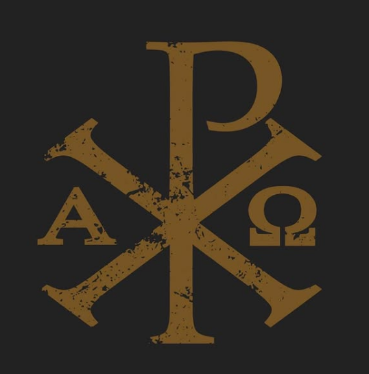

# Ex314.ai - A.I., Sanctified



## Theology without confusion. Philosophy without fog.

Ex314.ai is a groundbreaking Catholic theological AI assistant built on a custom fine-tuned Llama-3.3-70B-Instruct model. Trained on the entire Code of Canon Law, the Catechism of the Catholic Church, Vatican II documents, and other authoritative Catholic texts, it aims to explain, illuminate, and defend the faith with clarity, reverence, patience, and compassion.

> Not built to replace the Magisterium, but to serve it, this is the first LLM fine-tuned for clarity, approachability, and the New Evangelization. Trained on the full depth of Catholic teaching, it doesn't improvise or compromise. It explains, illuminates, and defends the faith with clarity, reverence, patience, and compassion—to find the lost seeking the Way, to steady the shaken searching for the Truth, and to shine the Light in the darkness for the questioning.

## 🚀 Vision and Mission

Ex314.ai was created to:

- Provide accurate, faithful Catholic theological explanations
- Make the richness of Catholic teaching accessible to modern seekers
- Support the New Evangelization through cutting-edge technology
- Serve as a digital companion for spiritual growth and understanding
- Bring clarity to complex theological concepts without compromise

## 📚 Training and Knowledge Base

Our LLM has been specifically fine-tuned on:

- The Catechism of the Catholic Church
- Code of Canon Law
- Vatican II Documents
- Church Fathers' writings
- Papal Encyclicals and Exhortations
- Summa Theologica and other scholastic works
- Modern Catholic theological texts
- Scripture with approved Catholic commentaries

This specialized training ensures the AI understands Catholic teaching in its proper context and can communicate it with both accuracy and pastoral sensitivity.

## 🛠️ Core Features

### Implemented Features
- **Liturgical Calendar**: Integration with the Church's liturgical year
- **Saints Directory**: Explore saints' lives and legacies
- **Prayer Resources**: Access traditional Catholic prayers
- **Daily Readings**: Connect with daily Mass readings
- **Authentication System**: Secure, flexible login system
- **Saints and Prayers APIs**: Programmatic access to spiritual content
- **Responsive Design**: Works on all devices
- **Admin Dashboard**: Content management for administrators

### Upcoming Features
- **Theological Chat Interface**: Powered by our custom fine-tuned Llama-3.3-70B-Instruct model
- **Citation System**: References to authoritative Catholic sources
- **Personalized Learning**: Tailored theological exploration paths
- **Parish Finder**: Connect users with local Catholic communities
- **Prayer Journals**: Track spiritual growth and intentions
- **Community Discussions**: Guided theological discourse
- **Multi-language Support**: Making Catholic teaching accessible globally

## 🧠 AI Philosophy

Ex314.ai is built with a distinct approach to AI:

1. **Faithful to the Magisterium**: The AI is designed to present Catholic teaching as taught by the Church, not to offer novel interpretations.

2. **Clear and Approachable**: Complex theology is explained in accessible language without reducing its depth.

3. **Pastorally Sensitive**: Responses balance doctrinal accuracy with compassion for those seeking understanding.

4. **Evangelically Oriented**: The AI aims to help those seeking truth to find it within Catholic teaching.

5. **Intellectually Rigorous**: Drawing on 2,000 years of Catholic intellectual tradition.

## 🖥️ Technical Implementation

### Frontend
- Next.js 15 with App Router
- Tailwind CSS with shadcn/ui components
- Fully responsive design
- Liturgical color theming
- Dark/light mode support

### Backend
- Clerk authentication with fallback mechanisms
- Supabase database integration
- Next.js API routes and server actions
- OpenAI API integration (transitional until custom model deployment)

### Custom LLM Deployment
- Llama-3.3-70B-Instruct fine-tuned model
- Catholic theological corpus training
- Parameter-efficient fine-tuning techniques
- Safety guardrails for sensitive topics
- Context window optimization for theological texts

## 📋 Requirements

- Node.js 18.x or higher
- npm or yarn
- Clerk.dev account (for authentication)
- Supabase (for database)
- Access keys for the deployed Llama model API

## ⚙️ Installation

1. **Clone the repository**
   ```bash
   git clone https://github.com/yourusername/ex314-revamp.git
   cd ex314-revamp
   ```

2. **Install dependencies**
   ```bash
   npm install
   # or
   yarn install
   ```

3. **Set up environment variables**
   Create a `.env.local` file in the root directory with the following variables:
   ```
   # Authentication (Clerk)
   NEXT_PUBLIC_CLERK_PUBLISHABLE_KEY=your_clerk_publishable_key
   CLERK_SECRET_KEY=your_clerk_secret_key
   
   # Database (Supabase)
   NEXT_PUBLIC_SUPABASE_URL=your_supabase_url
   SUPABASE_SERVICE_ROLE_KEY=your_supabase_key

   # LLM API (transitional until custom deployment)
   OPENAI_API_KEY=your_openai_key
   
   # Custom LLM API (when ready)
   CUSTOM_LLM_API_URL=your_api_url
   CUSTOM_LLM_API_KEY=your_api_key

   # Turnstile (CAPTCHA for forms)
   NEXT_PUBLIC_TURNSTILE_SITE_KEY=your_turnstile_site_key
   TURNSTILE_SECRET_KEY=your_turnstile_secret_key
   ```

4. **Run the development server**
   ```bash
   npm run dev
   # or
   yarn dev
   ```

5. **Open [http://localhost:3000](http://localhost:3000)** to see the application

## 🏗️ Project Structure

```
ex314-revamp/
├── app/               # Next.js App Router pages and layouts
│   ├── api/           # API routes including saints and prayers endpoints
│   ├── chat/          # AI chat interface (in development)
│   ├── saints/        # Saints directory
│   ├── prayers/       # Prayer resources
│   ├── calendar/      # Liturgical calendar
│   ├── admin/         # Admin dashboard
│   └── ...
├── components/        # Reusable React components
├── context/           # React context providers
├── hooks/             # Custom React hooks
├── lib/               # Utility functions and data
├── middleware/        # Next.js middleware
└── public/            # Static assets
```

## 🚦 API Endpoints

### Saints API
```
GET /api/saints - Get all saints
GET /api/saints?id={saintId} - Get specific saint
GET /api/saints?feastDate={date} - Filter by feast date
GET /api/saints?type={type} - Filter by type
GET /api/saints?patronOf={patronage} - Filter by patronage
```

### Prayers API
```
GET /api/prayers - Get all prayers
GET /api/prayers?id={prayerId} - Get specific prayer
GET /api/prayers?category={category} - Filter by category
GET /api/prayers?tag={tag} - Filter by tag
GET /api/prayers?search={term} - Search prayer content
```

## 📅 Liturgical Calendar

The liturgical calendar provides users with:

- Current liturgical season visualization
- Daily Mass readings
- Feast days and solemnities
- Saint commemorations
- Season-appropriate colors and themes

## 🙏 Development Status

Ex314.ai is actively under development, with key components like the custom LLM integration still in progress. The current focus is on building a robust platform to house the AI while finalizing the specialized model fine-tuning.

## 👨‍💻 Development Workflow

- `npm run dev` - Run the development server
- `npm run build` - Build the production application
- `npm run start` - Start the production server
- `npm run lint` - Run ESLint to check code quality

## 🤝 Contributing

Contributions to Ex314.ai are welcome, particularly in these areas:

- Catholic theological content accuracy
- UI/UX improvements
- Accessibility enhancements
- Performance optimizations
- Documentation improvements

Please submit pull requests with clear descriptions of your changes.

## 📜 License

This project is licensed under the [MIT License](LICENSE).

## 📧 Contact

For questions, support, or to learn more about Ex314.ai, please contact:
support@ex314.ai

---

> *"Faith and reason are like two wings on which the human spirit rises to the contemplation of truth."* - Pope St. John Paul II, Fides et Ratio

Ex314.ai aims to leverage the best of modern AI technology in service of timeless Catholic truth, making the richness of the Church's teaching accessible to all seekers in the digital age.